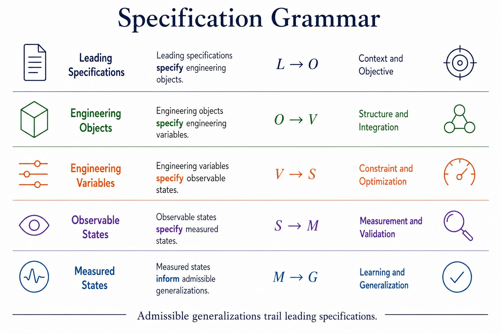

# Specification Grammar

A reusable engineering grammar plate for Notebook 00 and related technical reports.



## Canonical progression

Leading specifications specify engineering objects.  
Engineering objects specify engineering variables.  
Engineering variables specify observable states.  
Observable states specify measured states.  
Measured states inform admissible generalizations.

**Admissible generalizations trail leading specifications.**

## Repository structure

```text
specification-grammar/
├── source/      Editable vector master
├── exports/     Published PNG, SVG, and PDF assets
├── reference/   Approved raster reference used to build the vector master
├── icons/       Reusable outline icons
└── scripts/     Export and validation helpers
```

## Current status

The approved raster reference is included. The next production step is to recreate it as an editable SVG master with aligned typography, consistent icon strokes, and deterministic exports.

## Planned exports

- `exports/specification-grammar.svg`
- `exports/specification-grammar.pdf`
- `exports/specification-grammar.png`
- optional width-specific PNG exports

## Use

The grammar plate may be referenced from Notebook 00, repository READMEs, lab reports, seminar pages, and presentation materials.
